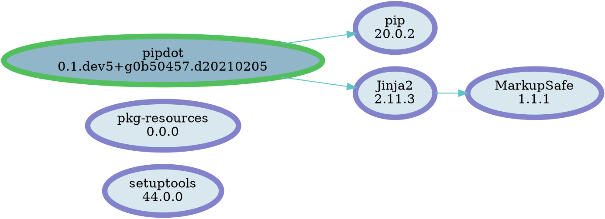

# pipdot

Generate a [Graphviz][] `dot` file representing installed [PyPI][] distributions.

## Installation

```sh
pip install pipdot
```

## Usage

Execute

```sh
pipdot out.dot
```

we'll get something like:



Run

```sh
python -m pipdot --help
```

for help messages

[PyPI]: https://pypi.org/
[pip]: https://pip.pypa.io/
[graphviz]: https://graphviz.org/
